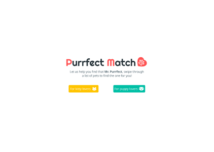
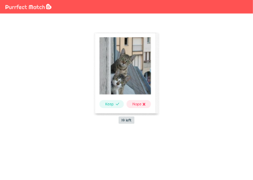

# Purrfect Match

##
Tinder like app where users explore and discover the best pet for them based on swiping on images they find appealing
## Live Preview
https://purrfect-match-five.vercel.app/

## User Story
As a user...
* I would like to know about the app
* I would like to be able to narrow my choice if I have a specific breed in mind
* I would like to be able to retry if I'm unsatisfied with my results

## MVP
* Fetch pet images from API and display as image cards
* Functions to cycle through image set and keep or discard card
* App that generates a match result from swiping down from a set of images

## Bonus
* Ability for user to switch between cats or dogs
* Ability for user to narrow down to a specific breed
* Add random facts for users to read up on
* Ability for user to save the results that they have gained (Login and firebase storage)
* Add swipping action for users to click and drag or swip on their phone

## Wireframes
### Landing Page

### Matching Page

## Tech Stack
* [React](https://reactjs.org/)
* [TheCatApi](https://docs.thecatapi.com/)
* [DogApi](https://dog.ceo/dog-api/)
* [react-spring](https://react-spring.io/)
* [use-gesture](https://use-gesture.netlify.app/)
* [redux](https://redux.js.org/)
